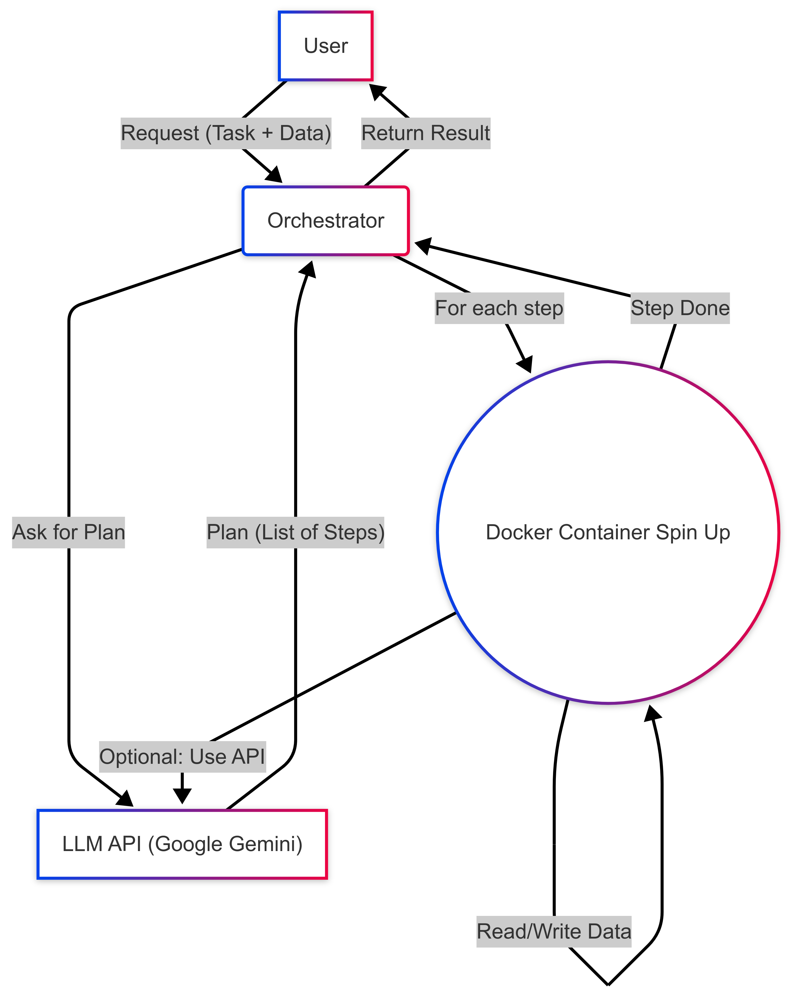

# llm-orchestrator

An LLM-powered container orchestrator.

## Overview

This project orchestrates a series of Docker containers, each running a microservice powered by Large Language Models (LLMs). It allows users to define a task, and the orchestrator determines the sequence of services needed to fulfill that task.

## Architecture

The orchestrator uses a central LLM to plan the execution of tasks across multiple specialized microservices.



1.  **User Request:** The user provides a task description and input text.
2.  **Orchestrator:** The main application that receives the user request.
3.  **LLM Planner:** An LLM that analyzes the user request and determines the optimal sequence of microservices.
4.  **Services:** Individual microservices (e.g., summarizer, translator, anonymizer) that perform specific tasks.
5.  **Data Storage:** A temporary directory used for inter-service communication.
6.  **Final Output:** The result of the orchestrated services.

## Setup

1.  **Prerequisites:**
    *   Docker: Ensure Docker is installed and running on your system.
    *   Python 3.9+: Ensure Python 3.9 or higher is installed.
    *   Google Cloud API Key: You need a Google Cloud API key with access to the Gemini API. Set this as an environment variable named `GOOGLE_API_KEY`. You can get it [here](https://aistudio.google.com/apikey)
    *   uv: Ensure uv is installed. You can install it using pip: `pip install uv`

2.  **Clone the repository:**

    ```bash
    git clone <repository_url>
    cd llm-orchestrator
    ```

3.  **Set up the environment:**

    *   Create a virtual environment using uv:

        ```bash
        uv venv
        source .venv/bin/activate
        ```

    *   Install the dependencies using uv:

        ```bash
        uv pip install -r pyproject.toml
        ```

    *   Create a `.env` file in the root directory and add your Google Cloud API key:

        ```
        GOOGLE_API_KEY=YOUR_API_KEY
        ```

4.  **Build the services:**

    ```bash
    bash build_services.sh
    ```

    This script builds the Docker images for each microservice.

5.  **Run the orchestrator:**

    ```bash
    python main.py
    ```

    Follow the prompts to enter your request and input text.

## Example Tasks

Here are some example tasks you can run with the orchestrator:

1.  **Summarize this article:**

    *   **Task Description:** `Summarize this article`
    *   **Sample Text:**

        ```text
        A lattice is an abstract structure studied in the mathematical subdisciplines of order theory and abstract algebra. It consists of a partially ordered set in which every pair of elements has a unique supremum (also called a least upper bound or join) and a unique infimum (also called a greatest lower bound or meet). An example is given by the power set of a set, partially ordered by inclusion, for which the supremum is the union and the infimum is the intersection. Another example is given by the natural numbers, partially ordered by divisibility, for which the supremum is the least common multiple and the infimum is the greatest common divisor. 
        ```

2.  **Translate this to German:**

    *   **Task Description:** `Translate this to German`
    *   **Sample Text:**

        ```text
        Hello, how are you doing today?
        ```

3.  **Anonymize this text and then summarize it:**

    *   **Task Description:** `Anonymize this text and then summarize it`
    *   **Sample Text:**

        ```text
        John Doe, born on 1990-01-01, lives at 123 Main Street, Anytown. His phone number is 555-1234 and email is john.doe@example.com.
        ```

4.  **Simplify the medical terms in this report and translate it to Spanish:**

    *   **Task Description:** `Anonymize, Simplify the medical terms in this report and translate it to German`
    *   **Sample Text:**

        ```text
        John Doe, a 45-year-old male residing at 123 Elm Street, Springfield, was admitted to City General Hospital on March 15, 2025, with complaints of persistent chest pain and shortness of breath. His medical history includes hypertension, Type 2 diabetes, and a prior myocardial infarction in 2018. Current medications include Lisinopril 10mg, Metformin 500mg, and Atorvastatin 20mg. Lab results indicated elevated troponin levels, and an ECG showed ST-elevation, prompting an emergency coronary angioplasty. He is currently under the care of Dr. Emily Carter in the Cardiology Department, with family members Jane Doe (spouse) and Michael Doe (son) listed as emergency contacts.
        ```

## Implemented Features

*   **Service Orchestration:** Dynamically plans and executes a sequence of microservices based on user requests.
*   **LLM Planning:** Uses an LLM to determine the optimal execution plan.
*   **Text Summarization:** Summarizes input text using the `summarizer-service`.
*   **Text Translation:** Translates input text to a specified language using the `translator-service`.
*   **Text Anonymization:** Anonymizes sensitive information in the input text using the `anonymizer-service`.
*   **Medical Term Simplification:** Simplifies complex medical terms using the `med-term-translator-service`.
